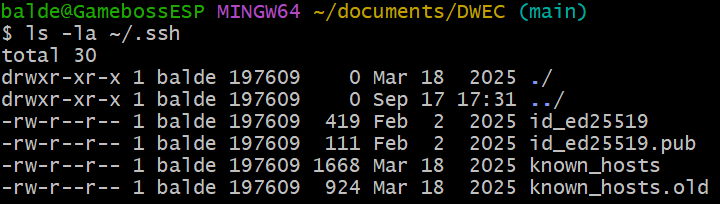
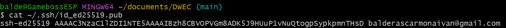
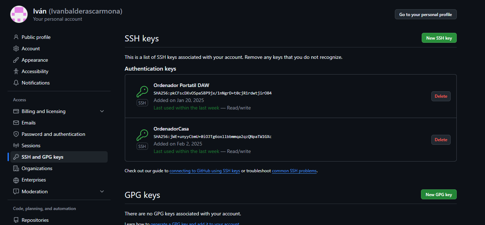
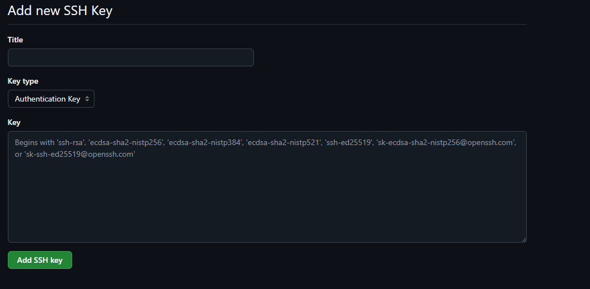
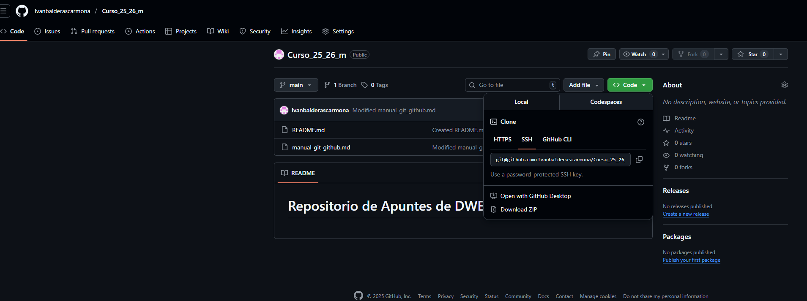

# Manual para configurar el git por ssh

## Primero inicializamos el repositorio.

```bash
git init
```

## En segundo lugar  configuramos nuestro usuario y nuestro email.

> Primero usaremos este comando para ver la configuracion que tenemos.
```bash
git config --list
```

```bash
git config --global user.name "tunombre"
git config --global user.email "tuemail@gmail.com"
```
> También aparte de configurar nuestro nombre y correo para identificarnos, cambiaremos el nombre de la rama por defecto.

```bash
git config --global init.defaultBranch "main"
```

## Para guardar los archivos en el staging area usamos este comando

>Antes de añadir nada podemos ver el estado de nuestros archivos si estan añadidos o no con el comando 

```bash
git status -s
```

>Este comando si queremos añadir todos 

```bash
git add .
```
>o si queremos un archivo en particular, se escribe el nombre en vez de poner el punto

```bash
git add archivo.md
```
## Para guardar esos archivos a un commit (un punto al que poder volver o ir) se usa este comando

```bash
git commit -m "Nombre del commit"
```

## Comprobamos si tenemos la clave ssh ya en nuestro ordenador

```bash
ls -la ~/.ssh
```
>Abajo tiene que salir algo parecido al las 4 últimas lineas de esta foto:
<p align="center">
  
</p>

## Instalacion de la clave en Github 
```bash
ssh-keygen -t ed25519 -C"balderascarmonaivan@gmail.com"
```


## Saber tu clave ssh publica para conectarte a Github
```bash
cat ~/.ssh/id_ed25519.pub
```

## Guardar la clave en Giithub
>En el resultado del comando anterior, nos dara algo así:

<p align="center">
  
</p>

>Debemos copiar todo ese texto hasta el .com sin copiar espacios de más. Nos vamos a este apartado de Github y pulsamos en New SSH key

<p align="center">
  
</p>

>Y ahora le ponemos un nombre identificativo y pegamos lo que copiamos en el recuadro que se llama key.

<p align="center">
  
</p>

> y la añadimos.

## Añadir la clave a Agent
>Se hace con los comandos:
```bash
1. eval "$(ssh-agent -s)"

2. ssh-agent ~/.ssh/id_ed25519
```
> Si no te funciona vas a powershell y lo arreglas ahi iniciando el servidor

## Verificar la clave

>Una vez ya conectado con github se prueba el siguiente comando
```bash
ssh -T git@github.com
```
> Si te funciona te saldra un saludo con tu nombre de usuario y que se ha conectado correctamente.

## Y por último añades tu ssh a la variable origin para poder hacer los push y pull

>Y en este apartado de tu repositoriio copias ese ssh que se ve en esta foto: 

<p align="center">
  
</p>

```bash
git remote add origin git@github.com:Ivanbalderascarmona/Curso_25_26_m.git
´´´

>Y asi ya te funcionaran los comandos 

``bash
git push origin main
git pull origin main
´´´